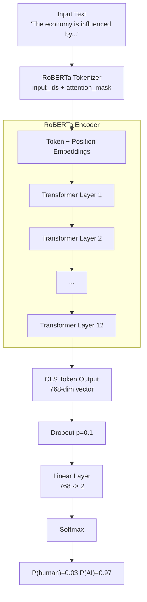
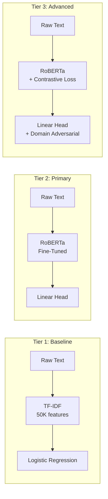
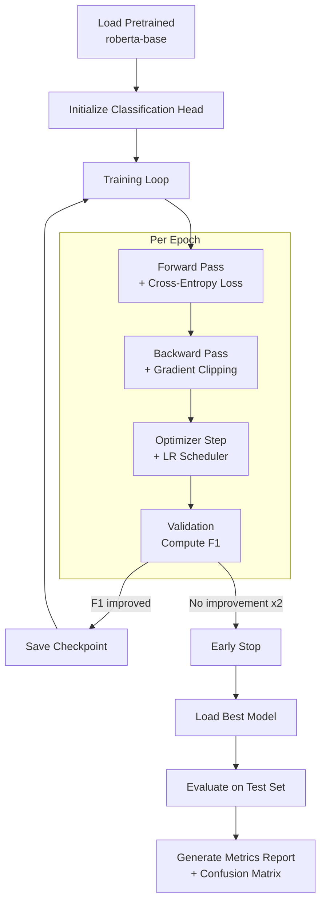

# AI-Generated Text Detector: Architecture & Implementation Design

> **Project**: MSE 446 -- Human vs. AI Text Classification
> **Dataset**: [Hello-SimpleAI/HC3](https://huggingface.co/datasets/Hello-SimpleAI/HC3)
> **Reference Paper**: [How Close is ChatGPT to Human Experts? Comparison Corpus, Evaluation, and Detection](https://arxiv.org/abs/2301.07597)

---

## Table of Contents

1. [Project Overview & Motivation](#1-project-overview--motivation)
2. [Dataset Analysis](#2-dataset-analysis)
3. [Architecture Design](#3-architecture-design)
4. [Data Pipeline](#4-data-pipeline)
5. [Training Pipeline](#5-training-pipeline)
6. [Evaluation Strategy](#6-evaluation-strategy)
7. [Project Directory Structure](#7-project-directory-structure)
8. [Dependencies](#8-dependencies)
9. [Architecture Diagrams](#9-architecture-diagrams)
10. [How to Reproduce](#10-how-to-reproduce)
11. [References](#11-references)

---

## 1. Project Overview & Motivation

### Problem Statement

Large Language Models (LLMs) such as ChatGPT, Gemini, and Claude can produce text that is increasingly difficult to distinguish from human writing. This project builds a binary classifier that, given a piece of text, predicts whether it was written by a **human** or generated by an **AI model**.

### Why This Matters


| Concern                  | Description                                                                                                                              |
| ------------------------ | ---------------------------------------------------------------------------------------------------------------------------------------- |
| **Academic Integrity**   | Students may submit AI-generated assignments as their own work. Reliable detection tools help educators maintain fair assessment.        |
| **Misinformation**       | AI can produce convincing but fabricated content at scale. Detection acts as a first line of defense for news outlets and fact-checkers. |
| **Trust & Transparency** | Readers, reviewers, and consumers of text deserve to know its provenance. Automated detection supports disclosure norms.                 |


### Scope

- **In scope**: Binary classification (human vs. ChatGPT) on English text across multiple domains.
- **Out of scope**: Multi-class attribution (which specific LLM generated the text), non-English text, real-time streaming detection.

---

## 2. Dataset Analysis

### 2.1 Source

The **Human ChatGPT Comparison Corpus (HC3)** provides paired human and ChatGPT answers to the same questions. It is hosted on HuggingFace under the `Hello-SimpleAI/HC3` repository and licensed under CC-BY-SA 4.0.

### 2.2 Schema

Each row in the JSONL files has the following structure:

```json
{
  "question": "What causes inflation?",
  "human_answers": ["Answer from human expert 1", "Answer from human expert 2"],
  "chatgpt_answers": ["Answer generated by ChatGPT"],
  "source": "finance"
}
```


| Field             | Type           | Description                                |
| ----------------- | -------------- | ------------------------------------------ |
| `question`        | `string`       | The input question/prompt                  |
| `human_answers`   | `list[string]` | One or more answers written by humans      |
| `chatgpt_answers` | `list[string]` | One or more answers generated by ChatGPT   |
| `source`          | `string`       | Domain label (only present in `all.jsonl`) |


### 2.3 Domain Breakdown


| Domain        | File                | Size    | Description                                |
| ------------- | ------------------- | ------- | ------------------------------------------ |
| `reddit_eli5` | `reddit_eli5.jsonl` | 55.4 MB | ELI5 subreddit Q&A (dominates the dataset) |
| `finance`     | `finance.jsonl`     | 9.89 MB | Financial Q&A from FiQA                    |
| `medicine`    | `medicine.jsonl`    | 2.68 MB | Medical dialogue data                      |
| `open_qa`     | `open_qa.jsonl`     | 2.91 MB | Open-domain questions from WikiQA          |
| `wiki_csai`   | `wiki_csai.jsonl`   | 2.20 MB | Wikipedia CS/AI FAQ                        |
| **all**       | `all.jsonl`         | 73.7 MB | Concatenation of all above                 |


**Total**: ~48,644 question rows; after flattening answers this yields significantly more individual text samples.

### 2.4 Preprocessing: Flattening

The raw dataset stores multiple answers per question. For binary classification, each individual answer becomes its own sample:

```
Raw row:
  question: Q
  human_answers: [H1, H2]
  chatgpt_answers: [C1]

Flattened to 3 samples:
  (text=H1, label=0, question=Q, source=...)
  (text=H2, label=0, question=Q, source=...)
  (text=C1, label=1, question=Q, source=...)
```

Where **label 0 = human** and **label 1 = AI-generated**.

### 2.5 Train / Validation / Test Split


| Split      | Proportion | Strategy                      |
| ---------- | ---------- | ----------------------------- |
| Train      | 70%        | Stratified by (domain, label) |
| Validation | 15%        | Stratified by (domain, label) |
| Test       | 15%        | Stratified by (domain, label) |


Stratification ensures each split preserves the per-domain class distribution. Splitting is done at the **question level** -- all answers derived from the same question land in the same split to prevent data leakage.

### 2.6 Class Balance

The dataset is roughly balanced between human and ChatGPT answers per domain, but `reddit_eli5` dominates overall volume. Two mitigations:

1. **Stratified sampling** across domains during splitting.
2. **Optional class weights** in the loss function if imbalance exceeds 60/40 after flattening.

---

## 3. Architecture Design

We adopt a three-tier approach, progressing from a simple baseline to the primary transformer model to an optional advanced extension.

### Tier 1: Baseline -- TF-IDF + Logistic Regression

**Purpose**: Establish a performance floor and provide a fast, interpretable reference point.

**Pipeline**:

1. Concatenate question + answer text (or answer-only -- ablate both).
2. Apply TF-IDF vectorization (`max_features=50000`, `ngram_range=(1,2)`).
3. Train a Logistic Regression classifier (`C=1.0`, `max_iter=1000`).
4. Optionally compare against a Linear SVM (`LinearSVC`).

**Expected performance**: ~85-92% accuracy based on prior literature -- TF-IDF captures shallow lexical cues (e.g., ChatGPT's tendency toward hedging phrases, formal connectives, and lower lexical diversity).

**Advantages**: Fast to train (~minutes), fully interpretable via feature coefficients, no GPU required.

### Tier 2: Fine-Tuned RoBERTa (Primary Approach)

**Purpose**: The main production-quality model. RoBERTa-based classifiers have been shown to achieve **98% F1** on the HC3 dataset.

**Base Model**: `[roberta-base](https://huggingface.co/roberta-base)` (125M parameters)

**Architecture**:

```
Input Text
    |
    v
[RoBERTa Tokenizer] --> input_ids, attention_mask
    |
    v
[RoBERTa Encoder]   --> hidden states (768-dim per token)
    |
    v
[CLS Token Pooling]  --> 768-dim vector
    |
    v
[Dropout (p=0.1)]
    |
    v
[Linear Layer]       --> 2 logits (human vs. AI)
    |
    v
[Softmax / Argmax]   --> prediction
```

**Key Design Decisions**:


| Decision            | Choice                               | Rationale                                                        |
| ------------------- | ------------------------------------ | ---------------------------------------------------------------- |
| Base model          | `roberta-base`                       | Proven on HC3; good balance of size and quality                  |
| Input format        | Answer text only (question optional) | Single-text detection is more general; QA-pair mode is a variant |
| Max sequence length | 512 tokens                           | RoBERTa's native limit; longer answers are truncated             |
| Classification head | Single linear layer on `[CLS]`       | Sufficient for binary classification; avoids overfitting         |
| Loss function       | Cross-Entropy                        | Standard for classification; supports class weights              |


**Hyperparameters**:


| Parameter     | Value                     | Notes                                       |
| ------------- | ------------------------- | ------------------------------------------- |
| Learning rate | 2e-5                      | Standard for fine-tuning transformers       |
| Batch size    | 16 or 32                  | Depends on available GPU memory             |
| Epochs        | 3-5                       | Early stopping monitors validation loss     |
| Warmup ratio  | 0.1                       | 10% of training steps use linear warmup     |
| Weight decay  | 0.01                      | Applied to all params except bias/LayerNorm |
| Scheduler     | Linear decay after warmup | Smooth convergence                          |
| Max grad norm | 1.0                       | Gradient clipping for stability             |


**Variant -- QA-Pair Mode**: Concatenate `[CLS] question [SEP] answer [SEP]` as input. This gives the model access to the question context, potentially improving accuracy when the answer's plausibility depends on the question.

### Tier 3: Advanced Extensions (Optional)

These are stretch goals for improved robustness:

**A. Contrastive Learning**

Train the encoder to pull human-text embeddings together and push AI-text embeddings apart in latent space. Use supervised contrastive loss (SupCon) alongside or instead of cross-entropy. This produces more robust stylistic embeddings that transfer better to unseen AI models.

**B. Multi-Domain Adversarial Training**

Add a domain classifier head with a gradient reversal layer. This forces the shared encoder to learn domain-invariant features, improving generalization across finance, medicine, reddit, etc.

**C. Ensemble**

Combine Tier 1 (TF-IDF + LR) predictions with Tier 2 (RoBERTa) predictions via a meta-classifier or simple averaging. Ensembles often improve calibration and robustness.

---

## 4. Data Pipeline

### 4.1 Loading

```python
from datasets import load_dataset

dataset = load_dataset("Hello-SimpleAI/HC3", "all", split="train")
```

This downloads `all.jsonl` (~73.7 MB) and loads it into a HuggingFace `Dataset` object.

### 4.2 Flattening

```python
import pandas as pd

def flatten_hc3(dataset):
    rows = []
    for item in dataset:
        question = item["question"]
        source = item.get("source", "unknown")
        for ans in item["human_answers"]:
            rows.append({
                "text": ans,
                "label": 0,
                "question": question,
                "source": source,
            })
        for ans in item["chatgpt_answers"]:
            rows.append({
                "text": ans,
                "label": 1,
                "question": question,
                "source": source,
            })
    return pd.DataFrame(rows)
```

### 4.3 Splitting (Question-Level Stratified)

```python
from sklearn.model_selection import train_test_split

questions = df[["question", "source", "label"]].drop_duplicates(subset="question")

train_q, temp_q = train_test_split(
    questions, test_size=0.30, stratify=questions["source"], random_state=42
)
val_q, test_q = train_test_split(
    temp_q, test_size=0.50, stratify=temp_q["source"], random_state=42
)

train_df = df[df["question"].isin(train_q["question"])]
val_df   = df[df["question"].isin(val_q["question"])]
test_df  = df[df["question"].isin(test_q["question"])]
```

### 4.4 Tokenization

```python
from transformers import AutoTokenizer

tokenizer = AutoTokenizer.from_pretrained("roberta-base")

def tokenize_fn(batch):
    return tokenizer(
        batch["text"],
        truncation=True,
        max_length=512,
        padding=False,  # dynamic padding handled by collator
    )
```

### 4.5 DataLoader

```python
from transformers import DataCollatorWithPadding
from torch.utils.data import DataLoader

collator = DataCollatorWithPadding(tokenizer=tokenizer)

train_loader = DataLoader(
    train_dataset, batch_size=16, shuffle=True, collate_fn=collator
)
val_loader = DataLoader(
    val_dataset, batch_size=32, shuffle=False, collate_fn=collator
)
```

---

## 5. Training Pipeline

### 5.1 Option A: HuggingFace Trainer (Recommended)

```python
from transformers import (
    AutoModelForSequenceClassification,
    TrainingArguments,
    Trainer,
)

model = AutoModelForSequenceClassification.from_pretrained(
    "roberta-base", num_labels=2
)

training_args = TrainingArguments(
    output_dir="./models/roberta-hc3",
    eval_strategy="epoch",
    save_strategy="epoch",
    learning_rate=2e-5,
    per_device_train_batch_size=16,
    per_device_eval_batch_size=32,
    num_train_epochs=5,
    weight_decay=0.01,
    warmup_ratio=0.1,
    load_best_model_at_end=True,
    metric_for_best_model="f1",
    fp16=True,
    logging_steps=100,
    report_to="none",
)

trainer = Trainer(
    model=model,
    args=training_args,
    train_dataset=train_dataset,
    eval_dataset=val_dataset,
    tokenizer=tokenizer,
    compute_metrics=compute_metrics,
)

trainer.train()
```

### 5.2 Option B: Custom PyTorch Loop

For more control (e.g., custom loss functions, gradient accumulation, mixed architectures):

```python
import torch
from torch.optim import AdamW
from transformers import get_linear_schedule_with_warmup

optimizer = AdamW(model.parameters(), lr=2e-5, weight_decay=0.01)
total_steps = len(train_loader) * num_epochs
scheduler = get_linear_schedule_with_warmup(
    optimizer, num_warmup_steps=int(0.1 * total_steps), num_training_steps=total_steps
)
scaler = torch.amp.GradScaler("cuda")

for epoch in range(num_epochs):
    model.train()
    for batch in train_loader:
        batch = {k: v.to(device) for k, v in batch.items()}
        with torch.amp.autocast("cuda"):
            outputs = model(**batch)
            loss = outputs.loss
        scaler.scale(loss).backward()
        scaler.unscale_(optimizer)
        torch.nn.utils.clip_grad_norm_(model.parameters(), max_norm=1.0)
        scaler.step(optimizer)
        scaler.update()
        scheduler.step()
        optimizer.zero_grad()
```

### 5.3 Early Stopping

Monitor validation loss at each epoch. Stop training if validation loss does not improve for 2 consecutive epochs. Restore the best checkpoint.

### 5.4 Checkpointing

Save the model after each epoch. Retain the best checkpoint (by validation F1) and delete older ones to save disk space. The HuggingFace `Trainer` handles this automatically with `load_best_model_at_end=True` and `save_total_limit=2`.

---

## 6. Evaluation Strategy

### 6.1 Metrics


| Metric        | Purpose                                                |
| ------------- | ------------------------------------------------------ |
| **Accuracy**  | Overall correctness                                    |
| **Precision** | Of predicted AI texts, how many are truly AI-generated |
| **Recall**    | Of all AI texts, how many did we catch                 |
| **F1-Score**  | Harmonic mean of precision and recall (primary metric) |
| **ROC-AUC**   | Threshold-independent discrimination ability           |


```python
from sklearn.metrics import (
    accuracy_score, precision_recall_fscore_support, roc_auc_score
)

def compute_metrics(eval_pred):
    logits, labels = eval_pred
    preds = logits.argmax(axis=-1)
    probs = torch.softmax(torch.tensor(logits), dim=-1)[:, 1].numpy()
    precision, recall, f1, _ = precision_recall_fscore_support(
        labels, preds, average="binary"
    )
    return {
        "accuracy": accuracy_score(labels, preds),
        "precision": precision,
        "recall": recall,
        "f1": f1,
        "roc_auc": roc_auc_score(labels, probs),
    }
```

### 6.2 Per-Domain Breakdown

Evaluate separately on each domain (reddit_eli5, finance, medicine, open_qa, wiki_csai) to identify where the model is weakest. Domains with specialized vocabulary (medicine, finance) may behave differently from casual text (reddit_eli5).

### 6.3 Confusion Matrix

Visualize true positives, false positives, true negatives, and false negatives. Pay special attention to:

- **False Negatives** (AI text classified as human): these are the dangerous failures in real-world use.
- **False Positives** (human text classified as AI): these are unfair accusations.

### 6.4 Out-of-Distribution (OOD) Considerations

The HC3 dataset only contains ChatGPT-generated text. A model trained solely on HC3 may not generalize to:

- Text from other LLMs (Gemini, Claude, Llama, etc.)
- Paraphrased or adversarially modified AI text
- Newer versions of ChatGPT (GPT-4, GPT-4o, etc.)

**Mitigation strategies**:

- Augment training data with samples from multiple LLMs if available.
- Use contrastive learning (Tier 3A) to learn general "AI style" features rather than ChatGPT-specific quirks.
- Evaluate on held-out datasets from other AI text detection benchmarks.

---

## 7. Project Directory Structure

```
MSE_446/
├── architecture.md              # This design document
├── requirements.txt             # Python dependencies with pinned versions
├── data/
│   ├── raw/                     # Downloaded JSONL files from HC3
│   └── processed/               # Train/val/test CSV splits after flattening
├── src/
│   ├── data_preprocessing.py    # Download, flatten, and split the dataset
│   ├── dataset.py               # PyTorch Dataset / HF Dataset wrappers
│   ├── model.py                 # Model definition (RoBERTa + classification head)
│   ├── train.py                 # Training loop / Trainer configuration
│   ├── evaluate.py              # Evaluation metrics and visualization
│   └── utils.py                 # Shared helpers (logging, config, seeding)
├── notebooks/
│   └── eda.ipynb                # Exploratory data analysis
├── models/                      # Saved model checkpoints
└── results/                     # Evaluation metrics, plots, confusion matrices
```

### File Responsibilities


| File                    | Responsibility                                                                                                                                      |
| ----------------------- | --------------------------------------------------------------------------------------------------------------------------------------------------- |
| `data_preprocessing.py` | Loads HC3 via HuggingFace `datasets`, flattens answers, performs question-level stratified splits, saves to `data/processed/`.                      |
| `dataset.py`            | Wraps processed CSVs into tokenized PyTorch datasets with `__getitem__` returning `input_ids`, `attention_mask`, and `label`.                       |
| `model.py`              | Defines the classifier. For Tier 2, this is a thin wrapper around `AutoModelForSequenceClassification`. For Tier 1, it houses the sklearn pipeline. |
| `train.py`              | Entry point for training. Parses CLI args, initializes model/data/optimizer, runs training with early stopping, saves best checkpoint.              |
| `evaluate.py`           | Loads a trained model, runs inference on test set, computes all metrics, generates per-domain breakdown and confusion matrix plots.                 |
| `utils.py`              | Seed setting, device selection, logging configuration, config dataclasses.                                                                          |


---

## 8. Dependencies

### `requirements.txt`

```
torch>=2.0
transformers>=4.35
datasets>=2.14
accelerate>=0.24
scikit-learn>=1.3
pandas>=2.0
numpy>=1.24
matplotlib>=3.7
seaborn>=0.12
tqdm>=4.65
```

### Hardware Requirements


| Component | Minimum                   | Recommended                    |
| --------- | ------------------------- | ------------------------------ |
| GPU       | NVIDIA GPU with 8 GB VRAM | NVIDIA A100 / RTX 3090 (24 GB) |
| RAM       | 16 GB                     | 32 GB                          |
| Disk      | 5 GB free                 | 20 GB free (for checkpoints)   |
| Python    | 3.10+                     | 3.11                           |


Tier 1 (TF-IDF + LR) can run on CPU only. Tier 2 (RoBERTa fine-tuning) requires a GPU for practical training times (~30-60 min on a single A100 with fp16).

---

## 9. Architecture Diagrams

### 9.1 End-to-End Data Flow

```mermaid
flowchart LR
    subgraph dataSource [Data Source]
        HF["HuggingFace HC3<br/>all.jsonl"]
    end

    subgraph preprocessing [Preprocessing]
        Flatten["Flatten Answers<br/>(text, label) pairs"]
        Split["Stratified Split<br/>70/15/15"]
    end

    subgraph tokenization [Tokenization]
        Tok["RoBERTa Tokenizer<br/>max_length=512"]
        Collator["DataCollatorWithPadding<br/>dynamic batching"]
    end

    subgraph model [Model]
        Encoder["RoBERTa Encoder<br/>12 layers, 768-dim"]
        CLS["CLS Pooling"]
        Head["Linear Head<br/>768 -> 2"]
    end

    subgraph output [Output]
        Pred["Prediction<br/>Human / AI"]
        Metrics["Evaluation<br/>F1, AUC, Accuracy"]
    end

    HF --> Flatten --> Split --> Tok --> Collator --> Encoder --> CLS --> Head --> Pred --> Metrics
```




### 9.2 Model Architecture (Tier 2 -- RoBERTa Classifier)




### 9.3 Three-Tier Comparison




### 9.4 Training Pipeline




---

## 10. How to Reproduce

### 10.1 Prerequisites

- Python 3.10+
- (Optional) NVIDIA GPU with CUDA support for Tier 2 training

> **GPU note**: This project was developed and tested on an NVIDIA Tesla P4 (compute capability 6.1, CUDA 11.8). If your GPU has a different architecture, the default PyTorch install (`pip install torch`) should work. If you encounter CUDA kernel errors, install a build matching your CUDA version — see [PyTorch's install page](https://pytorch.org/get-started/locally/).

### 10.2 Setup

```bash
# Clone the repository
git clone https://github.com/Max00358/AI-gen-text-detector.git
cd AI-gen-text-detector

# Create and activate a virtual environment
python -m venv .venv
source .venv/bin/activate        # bash / zsh
# source .venv/bin/activate.csh  # tcsh / csh

# Install dependencies
pip install -r requirements.txt
```

If you are on a machine with a CUDA 11.8 GPU (e.g. Tesla P4, GTX 1080), install the matching PyTorch build **before** the other dependencies:

```bash
pip install torch torchvision torchaudio --index-url https://download.pytorch.org/whl/cu118
pip install -r requirements.txt
```

### 10.3 Step 1 — Download and Preprocess the Dataset

This downloads the HC3 `all.jsonl` from HuggingFace, flattens the multi-answer rows into individual (text, label) samples, and creates stratified train/val/test CSV splits under `data/processed/`.

```bash
python -m src.data_preprocessing
```

Options:

| Flag | Description |
| --- | --- |
| `--subset finance` | Process a single domain instead of `all` |
| `--skip_download` | Reuse previously downloaded raw data |
| `--seed 42` | Random seed for splitting (default: 42) |

### 10.4 Step 2 — Train the Models

**Tier 1: TF-IDF + Logistic Regression baseline**

```bash
python -m src.train --tier 1 --classifier lr
```

Replace `lr` with `svm` to train a Linear SVM instead.

**Tier 2: Fine-tuned DistilRoBERTa**

```bash
python -m src.train --tier 2
```

This fine-tunes `distilroberta-base` using the HuggingFace `Trainer` with early stopping. Training hyperparameters (learning rate, batch size, epochs, etc.) are defined in `src/utils.py::TrainConfig` and can be overridden via CLI flags:

```bash
python -m src.train --tier 2 --lr 3e-5 --epochs 3 --batch_size 16
```

| Default Hyperparameter | Value |
| --- | --- |
| Model | `distilroberta-base` |
| Learning rate | 2e-5 |
| Batch size | 16 (effective 64 via gradient accumulation) |
| Gradient accumulation steps | 4 |
| Max sequence length | 512 |
| Epochs | 5 (with early stopping patience = 2) |
| FP16 | Disabled (no Tensor Cores on Tesla P4) |

The best checkpoint is saved to `models/roberta-hc3-best/`.

### 10.5 Step 3 — Evaluate

**Tier 1:**

```bash
python -m src.evaluate --tier 1 --classifier lr
```

**Tier 2:**

```bash
python -m src.evaluate --tier 2
```

To evaluate a checkpoint at a custom path:

```bash
python -m src.evaluate --tier 2 --model_path models/roberta-hc3-best
```

Evaluation outputs are written to `results/`:

| File | Description |
| --- | --- |
| `roberta_metrics.json` | Accuracy, precision, recall, F1, ROC-AUC |
| `roberta_confusion.png` | Confusion matrix heatmap |
| `roberta_roc.png` | ROC curve plot |
| `roberta_per_domain.csv` | Per-domain metric breakdown |

### 10.6 Our Results (Tier 2 — DistilRoBERTa)

| Metric | Score |
| --- | --- |
| Accuracy | 99.83% |
| Precision | 99.51% |
| Recall | 99.95% |
| F1 | 99.73% |
| ROC-AUC | 99.99% |

### 10.7 Loading the Pre-trained Model

The trained model weights are hosted on HuggingFace Hub (too large for GitHub). To load them directly:

```python
from transformers import AutoModelForSequenceClassification, AutoTokenizer

tokenizer = AutoTokenizer.from_pretrained("AyoMax00358/ai-text-detector")
model = AutoModelForSequenceClassification.from_pretrained("AyoMax00358/ai-text-detector")
```

To run inference on a text sample:

```python
import torch

text = "The economy is influenced by many factors including monetary policy..."
inputs = tokenizer(text, return_tensors="pt", truncation=True, max_length=512)

with torch.no_grad():
    logits = model(**inputs).logits

pred = logits.argmax(dim=-1).item()
print("AI-generated" if pred == 1 else "Human-written")
```

---

## 11. References

1. Guo, B., Zhang, X., Wang, Z., Jiang, M., Nie, J., Ding, Y., Yue, J., & Wu, Y. (2023). *How Close is ChatGPT to Human Experts? Comparison Corpus, Evaluation, and Detection*. [arXiv:2301.07597](https://arxiv.org/abs/2301.07597)
2. Liu, Y., Ott, M., Goyal, N., et al. (2019). *RoBERTa: A Robustly Optimized BERT Pretraining Approach*. [arXiv:1907.11692](https://arxiv.org/abs/1907.11692)
3. Tian, E., et al. (2026). *GPTZero: Robust Detection of LLM-Generated Texts*. [arXiv:2602.13042](https://arxiv.org/abs/2602.13042)
4. He, X., et al. (2024). *DeTeCtive: Detecting AI-generated Text via Multi-Level Contrastive Learning*. [arXiv:2410.20964](https://arxiv.org/abs/2410.20964)
5. HuggingFace Model: [Hello-SimpleAI/chatgpt-detector-roberta](https://huggingface.co/Hello-SimpleAI/chatgpt-detector-roberta)

